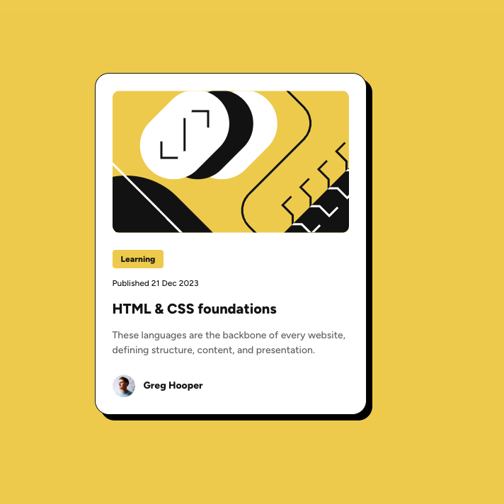

# Frontend Mentor - Blog preview card solution

This is a solution to the [Blog preview card challenge on Frontend Mentor](https://www.frontendmentor.io/challenges/blog-preview-card-ckPaj01IcS). Frontend Mentor challenges help you improve your coding skills by building realistic projects.

## Table of contents

- [Frontend Mentor - Blog preview card solution](#frontend-mentor---blog-preview-card-solution)
  - [Table of contents](#table-of-contents)
  - [Overview](#overview)
    - [The challenge](#the-challenge)
    - [Screenshot](#screenshot)
    - [Links](#links)
  - [My process](#my-process)
    - [Built with](#built-with)
    - [What I learned](#what-i-learned)
    - [Continued development](#continued-development)
    - [Useful resources](#useful-resources)
  - [Author](#author)
  - [Acknowledgments](#acknowledgments)

**Note: Delete this note and update the table of contents based on what sections you keep.**

## Overview

### The challenge

Creating a Responsive Blog Preview Card

### Screenshot

### Links

- Solution URL: [Add solution URL here](https://github.com/sruthimadira7/blog-preview-card-main)
- Live Site URL: [Add live site URL here](https://spiffy-gecko-d88dec.netlify.app/)

## My process

My very first thought is that I focussed on getting the layout right. As this is a simple blog preview card, Once I am done with the layout thing.

I broke the inner contents into three different sections:

- The first section only contains the image.
- The second section contains the most important information.
- The last section consisted of avatar image and name.

### Built with

- Self-host fonts
- Layout and Accessibility
- Semantic HTML5 markup
- CSS custom properties
- Flexbox
- Mobile-first workflow
- BEM Naming

### What I learned

I thought that I can build this simple component within no time.. but it took me a while like almost 2hrs.
The key take away from here is that it is difficult to build a pixel perfect design.
It comes down to those minor details like how you make things reponsive with respect to different screen widths.

### Continued development

I want to do more and more projects and see how far I can reach in building projects I Love.
I want to improve on layout and resposive thing.

### Useful resources

- [CSS Variables](https://www.joshwcomeau.com/css/css-variables-for-react-devs/) - This helped me in giving a better name for my custom properties. I really liked this naming and will use it going forward.
- [Box-Shadow](https://developer.mozilla.org/en-US/docs/Web/CSS/Reference/Properties/box-shadow) - This is an amazing article which helped me finally understand box-shadow. I'd recommend it to anyone still learning this concept.

## Author

- Frontend Mentor - [@sruthimadira7](https://www.frontendmentor.io/profile/sruthimadira7)

## Acknowledgments

I want to give credit to my brother [@astrodeveloper10](https://www.frontendmentor.io/profile/astrodeveloper10). He told me that I can do anything in life. I love him❤️.I am telling you all you can do anything that you are dreaming of. Just need to put your mind.Bye!
